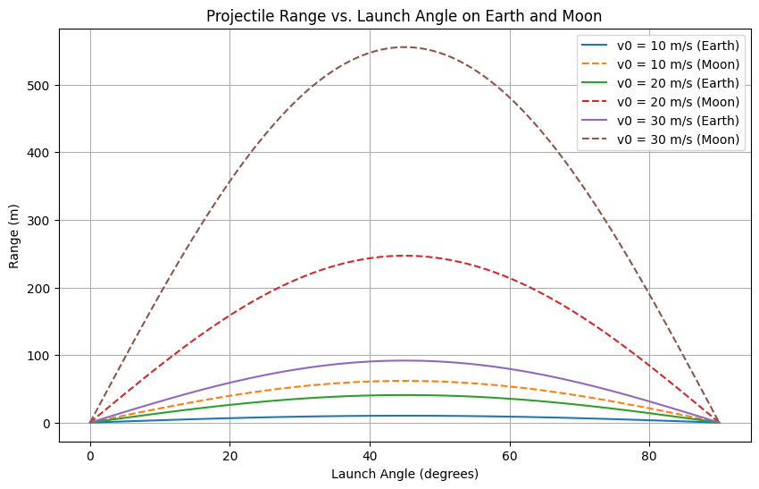

# Problem 1

# Investigating the Range as a Function of the Angle of Projection

## Introduction

Projectile motion is a fundamental topic in mechanics that describes the motion of an object launched into the air under the influence of gravity, assuming no air resistance. The horizontal distance traveled by the projectile, known as the **range**, is a function of the launch angle and initial velocity.

## Theoretical Background

The motion of a projectile can be analyzed by decomposing it into horizontal and vertical components. The equations of motion are:

### Equations of Motion

- **Horizontal motion:**
  $x = v_0 \cos(\theta) t$
  Since there is no acceleration in the horizontal direction (ignoring air resistance), the horizontal velocity remains constant.

- **Vertical motion:**
  $y = v_0 \sin(\theta) t - \frac{1}{2} g t^2$
  where $g$ is the acceleration due to gravity.

We’re analyzing **projectile motion** where an object is launched at an angle $\theta$ with an **initial velocity** $v_0$, and lands at the **same height** it was launched from.

## 1.  Total Time of Flight

Vertical motion equation:

$$
y(t) = v_0 \sin(\theta) t - \frac{1}{2} g t^2
$$

To find **total flight time**, set $y = 0$ (back at launch height):

$$
0 = v_0 \sin(\theta) t - \frac{1}{2} g t^2
$$

Factor:

$$
t \left( v_0 \sin(\theta) - \frac{1}{2} g t \right) = 0
$$

Solutions:

- $t = 0$ (initial launch)
- $t = \frac{2 v_0 \sin(\theta)}{g}$

So the **total time of flight** is:

$$
t_{\text{total}} = \frac{2 v_0 \sin(\theta)}{g}
$$

---

## 2.  Horizontal Range

Now we consider horizontal motion. There’s no acceleration horizontally, so it's a simple:

- ### Distance = speed × time

Horizontal velocity is:

$$
v_0 \cos(\theta)
$$

Multiply by total flight time to get the **range**:

$$
R = v_0 \cos(\theta) \cdot \frac{2 v_0 \sin(\theta)}{g}
$$

Use identity:

$$
2 \sin(\theta) \cos(\theta) = \sin(2\theta)
$$

So:

$$
R = \frac{v_0^2 \sin(2\theta)}{g}
$$

###  Summary

- **Total Time of Flight:**

  $$
  t_{\text{total}} = \frac{2 v_0 \sin(\theta)}{g}
  $$

- **Range:**

  $$
  R = \frac{v_0^2 \sin(2\theta)}{g}
  $$

##  How Range Depends on the Angle of Projection

The formula for the horizontal range of a projectile is:

$$
R(\theta) = \frac{v_0^2}{g} \cdot \sin(2\theta)
$$

Where:

- $v_0$ is the initial velocity,
- $g$ is the acceleration due to gravity,
- $\theta$ is the angle of projection,
- and $\sin(2\theta)$ captures how the angle affects the range.

###  Angle Observations

- The **range depends on $\sin(2\theta)$**, which reaches its **maximum value when $\theta = 45^\circ$**.
- Therefore, the **maximum range** occurs when the projectile is launched at **45 degrees**.
- The function $\sin(2\theta)$ is **symmetric** about $45^\circ$:
  - For example, $30^\circ$ and $60^\circ$ give the **same range**.
  - Similarly, $20^\circ$ and $70^\circ$ give the same range.

###  Graph Shape:

If you were to graph the range against the angle $\theta$, you would get a **sine curve** shape, peaking at $45^\circ$ and symmetric on both sides.

This symmetry explains why certain pairs of angles produce the same horizontal range.

## Visualization of Range 

### Constants

- Gravitational acceleration on Earth: $g_{earth} = 9.81$ m/s²
- Gravitational acceleration on the Moon: $g_{moon} = 1.62$ m/s²
- Initial velocities considered: $10, 20, 30$ m/s

### Range Calculation and Visualization

We analyze the range for different launch angles (0° to 90°) and compare it for Earth and Moon conditions.

#  Projectile Motion Simulation

This interactive simulation shows how the **range** of a projectile changes with the **launch angle**.

 **[Click here to view the simulation](simulation.html)** 

Enter the initial velocity and see how the range changes dynamically!

## Observations

- The range is maximized at $\theta = 45^\circ$.
- Increasing $v_0$ increases the overall range.
- The range is significantly greater on the Moon due to lower gravity.

## Numerical Example

For an initial velocity of $v_0 = 20$ m/s and a launch angle of $\theta = 45^\circ$ :

- **On Earth:**
  $R = \frac{20^2 \sin(90^\circ)}{9.81} \approx 40.8 \text{ m}$
- **On the Moon:**
  $R = \frac{20^2 \sin(90^\circ)}{1.62} \approx 247.8 \text{ m}$

## Practical Applications

- **Ballistics**: Understanding projectile motion is crucial for artillery and missile trajectories.
- **Sports**: Optimizing the launch angle in sports like basketball, soccer, and golf.
- **Space Exploration**: Calculating trajectories for lunar landings and rover deployments.
