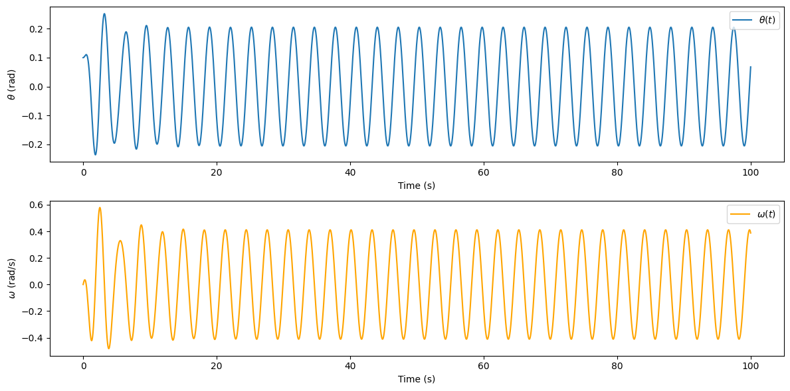
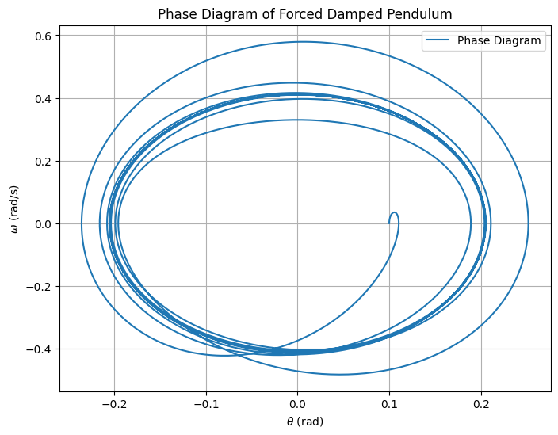
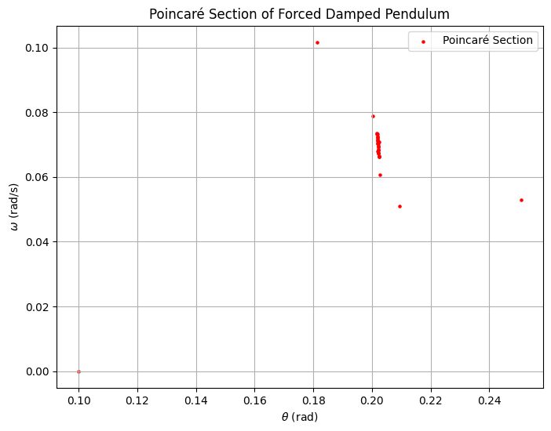

# Problem 2

## Theoretical Foundation

The forced damped pendulum is a captivating example of a physical system with intricate behavior resulting from the interplay of damping, restoring forces, and external driving forces. By introducing both damping and external periodic forcing, the system demonstrates a transition from simple harmonic motion to a rich spectrum of dynamics, including resonance, chaos, and quasiperiodic behavior. These phenomena serve as a foundation for understanding complex real-world systems, such as driven oscillators, climate systems, and mechanical structures under periodic stress.

## Types of Pendulums

---

### 1. Regular Pendulum (No damping or force)

This is just a mass on a string, swinging under gravity.

- Motion is smooth and regular.
- If you lift and release it, it keeps swinging back and forth.
- It has a **natural frequency** depending on length and gravity.

---

### 2. Damped Pendulum

Now we add **damping**, which means it **loses energy** over time (due to air resistance or friction in the pivot).

- The pendulum slows down.
- Eventually, it comes to rest.
- Damping is modeled by a term like $b \frac{d\theta}{dt}$ in the equation (where $b$ is the damping coefficient).

---

### 3. Forced Pendulum

Now imagine we **keep pushing** the pendulum at regular intervals — like tapping it with a finger over and over.

- This is a **driving force** or **external forcing**.
- It’s usually sinusoidal: $A \cos(\omega t)$ — like a wave that keeps pushing the pendulum.
- Even though it loses energy through damping, the external force **feeds energy back in**.

---

## Governing Equation

The motion of a forced damped pendulum is governed by the differential equation:

$$
\frac{d^2\theta}{dt^2} + \gamma\frac{d\theta}{dt} + \sin(\theta) = F_d\cos(\omega_d t)
$$

where:

- $\theta$ is the angular displacement,

Angular displacement measures how far an object has rotated from its starting position — like how much a pendulum has swung from its resting point.

- $\gamma$ is the damping coefficient,

which quantifies the strength of damping (friction or resistance) in the system.

- $F_d$ is the amplitude of the external forcing,

representing the maximum strength of the periodic external force applied to the system.

- $\omega_d$ is the driving frequency.

which is the frequency of the external periodic force driving the system.

---

For small angles, we approximate $\sin(\theta) \approx \theta$, simplifying the equation to:

$$
\frac{d^2\theta}{dt^2} + \gamma\frac{d\theta}{dt} + \theta = F_d\cos(\omega_d t)
$$

This equation resembles the standard damped driven oscillator.

## Approximate Solutions

The general solution for small-angle oscillations can be expressed as:

$$
\theta(t) = A e^{-\gamma t} \cos(\omega t + \phi) + \theta_{p}(t)
$$

where $\theta_{p}(t)$ is the particular solution due to external forcing. The amplitude and phase of the response depend on resonance conditions.

## Resonance Conditions

Resonance occurs when the driving frequency $\omega_d$ is close to the system's natural frequency:

$$
\omega_0 = \sqrt{1 - \gamma^2}
$$

At resonance, the amplitude of oscillations peaks, which can be critical in engineering applications such as bridges and buildings. For example, the **Tacoma Narrows Bridge collapse** was a consequence of wind-induced resonance.

## Energy Considerations

The total energy of the system is affected by damping and external forcing. The balance between energy input and dissipation determines whether oscillations persist, decay, or become chaotic.

# Analysis of Dynamics

## Influence of System Parameters

The behavior of the forced damped pendulum depends on the parameters $\gamma$, $F_d$, and $\omega_d$:

- **Damping Coefficient ($\gamma$):**
  - High damping reduces oscillations and accelerates settling.
  - Low damping prolongs oscillations and can lead to chaotic behavior.

- **Driving Amplitude ($F_d$):**
  - Small $F_d$ results in nearly harmonic motion.
  - Large $F_d$ may induce chaos.

- **Driving Frequency ($\omega_d$):**
  - Near resonance ($\omega_d \approx \omega_0$), the amplitude is maximized.
  - Off-resonance driving leads to steady oscillations at lower amplitudes.

## Transition from Regular to Chaotic Motion

The system undergoes a transition through different dynamic regimes:

- **Regular Motion:** At low forcing, motion is periodic and predictable.
- **Quasiperiodic Motion:** Increased forcing introduces complex but non-chaotic patterns.
- **Chaotic Motion:** High $F_d$ leads to chaotic behavior with extreme sensitivity to initial conditions.

## Chaos Analysis

The transition to chaos is analyzed using:

- **Poincar\'e Sections** to identify periodic and chaotic attractors.
- **Bifurcation Diagrams** showing transitions between periodicity and chaos.
- **Lyapunov Exponents** quantifying sensitivity to initial conditions.

These analyses help understand chaotic behavior in physical systems like climate models, mechanical oscillators, and biological rhythms.

## Step 1: Define the Forced Damped Pendulum Equation

👉 **[Click here to view the simulation](simulation1.html)** 👈

The equation of motion for a forced damped pendulum is:

$$
\frac{d^2\theta}{dt^2} + \frac{b}{m} \frac{d\theta}{dt} + \frac{g}{L} \sin(\theta) = F \cos(\omega_d t)
$$

Where:

- $\theta$: Angular displacement.
- $b$: Damping coefficient.
- $m$: Mass of the pendulum bob.
- $g$: Acceleration due to gravity.
- $L$: Length of the pendulum.
- $F$: Amplitude of the driving force.
- $\omega_d$: Angular frequency of the driving force.

This can be rewritten as a system of first-order differential equations:

$$
\frac{d\theta}{dt} = \omega
$$

$$
\frac{d\omega}{dt} = -\frac{b}{m} \omega - \frac{g}{L} \sin(\theta) + F \cos(\omega_d t)
$$

---

## Step 2: Implement the Model in Python

Below is the Python code to simulate the system:

## A phase diagram plots the angular velocity $\omega$ against the angular displacement $\theta$.

## Step 4: Plot Poincaré Sections

## A Poincaré section is a way to visualize chaotic behavior. We sample the system at a fixed phase of the driving force (e.g., every $2\pi/\omega_d$).

