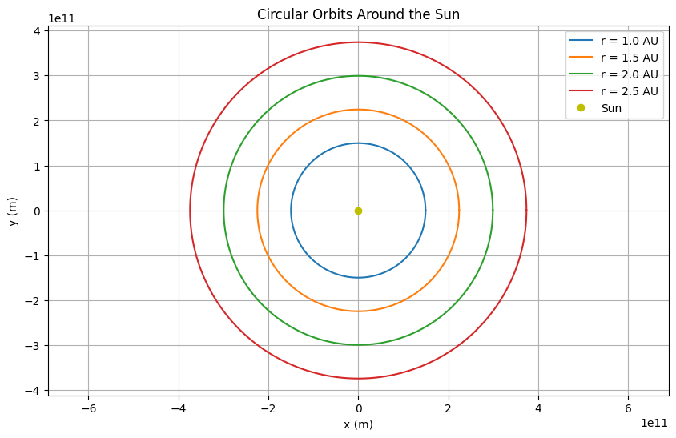
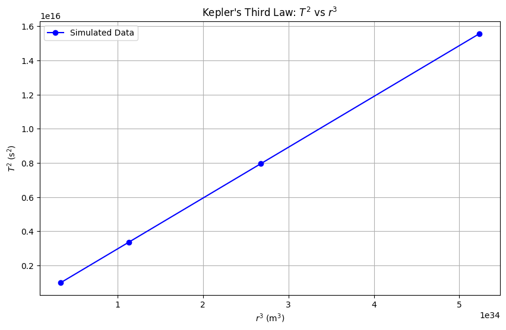

# Problem 1
# Gravity: Orbital Period and Orbital Radius

## Motivation

The relationship between the square of the orbital period and the cube of the orbital radius, known as **Kepler's Third Law**, is a fundamental principle in celestial mechanics. This law provides a mathematical connection between the motion of celestial bodies and the gravitational forces governing them. It has far-reaching implications, from understanding the dynamics of planetary systems to designing satellite orbits. By exploring this relationship, we can uncover insights into gravitational interactions and apply them to real-world scenarios, such as the orbits of planets in our Solar System or the motion of artificial satellites.

## Task Breakdown

1. **Derive the relationship** between the square of the orbital period and the cube of the orbital radius for circular orbits.
2. **Discuss the implications** of this relationship in astronomy, including its role in calculating planetary masses and distances.
3. **Analyze real-world examples**, such as the Moon's orbit around Earth and the orbits of planets in the Solar System.
4. **Implement a computational model** to simulate circular orbits and verify the relationship.
5. **Deliverables**:
   - A detailed explanation of the concepts.
   - A Python script or notebook implementing the simulations.
   - Graphical representations of circular orbits and the relationship between orbital period and radius.
   - A discussion on how this relationship extends to elliptical orbits and other celestial bodies.

---

## 1. Derivation of Kepler's Third Law for Circular Orbits

### Setup

Consider a body (e.g., a planet or satellite) of mass $m$ in a circular orbit around a central body (e.g., a star or planet) of mass $M$, where $M \gg m$. The radius of the orbit is $r$, and the orbital period is $T$, the time it takes to complete one full revolution.

### Step 1: Gravitational Force as the Centripetal Force

For a circular orbit, the gravitational force between the two bodies provides the centripetal force required to keep the smaller body in its orbit. The gravitational force is given by Newton's law of gravitation:

$$
F_g = \frac{G M m}{r^2}
$$

where $G$ is the gravitational constant ($G \approx 6.674 \times 10^{-11} \, \text{m}^3 \text{kg}^{-1} \text{s}^{-2}$).

The centripetal force required for circular motion is:

$$
F_c = \frac{m v^2}{r}
$$

where $v$ is the orbital velocity of the smaller body.

Equating the two forces:

$$
\frac{G M m}{r^2} = \frac{m v^2}{r}
$$

The $m$ terms cancel out (since $m \neq 0$), and we simplify:

$$
\frac{G M}{r^2} = \frac{v^2}{r}
$$

Multiply both sides by $r$:

$$
\frac{G M}{r} = v^2
$$

$$
v = \sqrt{\frac{G M}{r}}
$$

### Step 2: Relate Orbital Velocity to the Period

The orbital velocity $v$ can also be expressed in terms of the circumference of the orbit and the period $T$. The circumference of the circular orbit is $2 \pi r$, and the body completes one orbit in time $T$, so:

$$
v = \frac{\text{distance}}{\text{time}} = \frac{2 \pi r}{T}
$$

Substitute this expression for $v$ into the equation from Step 1:

$$
\frac{2 \pi r}{T} = \sqrt{\frac{G M}{r}}
$$

Square both sides to eliminate the square root:

$$
\left( \frac{2 \pi r}{T} \right)^2 = \frac{G M}{r}
$$

$$
\frac{4 \pi^2 r^2}{T^2} = \frac{G M}{r}
$$

Multiply both sides by $T^2$ and divide by $r$:

$$
4 \pi^2 r^2 = \frac{G M}{r} T^2
$$

Multiply both sides by $r$:

$$
4 \pi^2 r^3 = G M T^2
$$

Rearrange to isolate $T^2$:

$$
T^2 = \frac{4 \pi^2}{G M} r^3
$$

This is **Kepler's Third Law** for circular orbits: the square of the orbital period $T^2$ is proportional to the cube of the orbital radius $r^3$. The constant of proportionality is $\frac{4 \pi^2}{G M}$, which depends on the mass of the central body $M$.

---

## 2. Implications of Kepler's Third Law in Astronomy

### Calculating Planetary Masses

Kepler's Third Law allows us to determine the mass of a central body if we know the orbital period and radius of a body orbiting it. Rearrange the equation:

$$
M = \frac{4 \pi^2 r^3}{G T^2}
$$

For example, by observing the orbit of a moon around a planet (e.g., the Moon around Earth), we can measure $r$ and $T$ and calculate $M$, the mass of the planet. This method is widely used to estimate the masses of planets, stars, and even black holes (by observing the orbits of stars or gas clouds around them).

### Determining Orbital Distances

If the mass of the central body is known (e.g., the Sun's mass), Kepler's Third Law can be used to calculate the orbital radius of a planet or satellite given its period, or vice versa. This is crucial for mapping planetary systems and predicting the positions of celestial bodies.

### Understanding Orbital Dynamics

The law reveals that planets farther from the Sun have longer orbital periods, which is why Jupiter (at about 5.2 AU from the Sun) takes much longer to orbit than Earth (at 1 AU). This relationship also helps in designing satellite orbits, ensuring they have the correct period for their intended altitude.

---

## 3. Real-World Examples

### The Moon's Orbit Around Earth

- **Orbital radius**: The average distance from Earth to the Moon is $r \approx 384,400 \, \text{km} = 3.844 \times 10^8 \, \text{m}$.
- **Orbital period**: The Moon's orbital period (sidereal month) is $T \approx 27.32 \, \text{days} = 27.32 \times 24 \times 60 \times 60 = 2.36 \times 10^6 \, \text{s}$.
- **Mass of Earth**: $M \approx 5.972 \times 10^{24} \, \text{kg}$.

Using Kepler's Third Law:

$$
T^2 = \frac{4 \pi^2}{G M} r^3
$$

$$
(2.36 \times 10^6)^2 = \frac{4 \pi^2}{(6.674 \times 10^{-11}) (5.972 \times 10^{24})} (3.844 \times 10^8)^3
$$

$$
5.57 \times 10^{12} \approx 9.91 \times 10^{-14} \times 5.68 \times 10^{25}
$$

$$
5.57 \times 10^{12} \approx 5.63 \times 10^{12}
$$

The values are very close, confirming that the Moon's orbit obeys Kepler's Third Law. Small discrepancies are due to the Moon's slightly elliptical orbit and perturbations from other bodies.

### Planets in the Solar System

For planets orbiting the Sun, we can compare their periods and radii. The Sun's mass is $M \approx 1.989 \times 10^{30} \, \text{kg}$. For Earth:

- $r = 1 \, \text{AU} = 1.496 \times 10^{11} \, \text{m}$
- $T = 1 \, \text{year} = 3.156 \times 10^7 \, \text{s}$

$$
T^2 = (3.156 \times 10^7)^2 = 9.96 \times 10^{14}
$$

$$
r^3 = (1.496 \times 10^{11})^3 = 3.347 \times 10^{33}
$$

$$
\frac{T^2}{r^3} = \frac{9.96 \times 10^{14}}{3.347 \times 10^{33}} \approx 2.98 \times 10^{-19} \, \text{s}^2 \text{m}^{-3}
$$

This ratio should be constant for all planets orbiting the Sun, as $\frac{T^2}{r^3} = \frac{4 \pi^2}{G M}$. For Jupiter ($r \approx 5.2 \, \text{AU}$, $T \approx 11.86 \, \text{years}$), the ratio is nearly the same, confirming the law's universality.

---

## 4. Computational Model to Simulate Circular Orbits

### Python Script

Below is a Python script that simulates a circular orbit, calculates the orbital period, and verifies Kepler's Third Law by plotting $T^2$ versus $r^3$ for different orbital radii.

