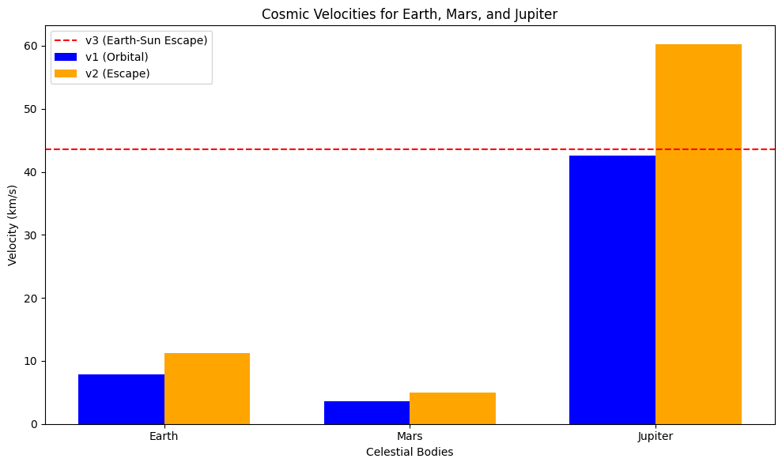

# Escape Velocities and Cosmic Velocities

## Introduction

The concept of escape velocity is crucial for understanding the conditions required to leave a celestial body's gravitational influence. Extending this concept, the first, second, and third cosmic velocities define the thresholds for orbiting, escaping, and leaving a star system. These principles underpin modern space exploration, from launching satellites to interplanetary missions.

This document defines the first, second, and third cosmic velocities, explains their physical meaning, derives their equations, calculates them for Earth, Mars, and Jupiter, and includes a Python script to visualize these velocities.

---

## Definitions and Physical Meaning

### First Cosmic Velocity (Orbital Velocity)

The **first cosmic velocity** ($v_1$) is the minimum speed required for an object to enter a circular orbit around a celestial body at its surface.

- **Physical Meaning**: At $v_1$, an object orbits without falling back or escaping. For Earth, this is the speed of low Earth orbit (LEO) satellites.

### Second Cosmic Velocity (Escape Velocity)

The **second cosmic velocity** ($v_2$) is the speed required to escape a celestial body’s gravitational influence from its surface.

- **Physical Meaning**: At $v_2$, kinetic energy equals gravitational potential energy, allowing escape to infinity. It’s the threshold for leaving a planet.

### Third Cosmic Velocity

The **third cosmic velocity** ($v_3$) is the speed required to escape the gravitational pull of a star (e.g., the Sun) from a planet’s surface.

- **Physical Meaning**: This enables interstellar travel, overcoming both planetary and stellar gravity.

--------------------------------------------------------
**Voyager 1** is a space probe launched by **NASA** on **September 5, 1977**, as part of the **Voyager program**. It was designed to explore the outer planets and is now the **farthest human-made object from Earth**, traveling into **interstellar space**.

## Speed & Distance 

- **Current Speed:** ~ **17 km/s** (~3.6 AU per year).
- **Current Distance:** Over **24 billion km (160+ AU)** from Earth.
- **Signal Delay:** It takes **over 22 hours** for a signal from Voyager 1 to reach Earth.

---

## Mathematical Derivations

### First Cosmic Velocity ($v_1$)

Gravitational force equals centripetal force for a circular orbit:
$$
\frac{G M m}{r^2} = \frac{m v_1^2}{r}
$$
Where:

- $G = 6.67430 \times 10^{-11} \, \text{m}^3 \text{kg}^{-1} \text{s}^{-2}$ (gravitational constant),
- $M$ = mass of the body,
- $m$ = mass of the object (cancels out),
- $r$ = radius of the body.

Simplifying:
$$
v_1 = \sqrt{\frac{G M}{r}}
$$

### Second Cosmic Velocity ($v_2$)

From energy conservation (kinetic + potential = 0 at infinity):
$$
\frac{1}{2} m v_2^2 - \frac{G M m}{r} = 0
$$
Simplifying:
$$
v_2 = \sqrt{\frac{2 G M}{r}}
$$
Note: $v_2 = \sqrt{2} \cdot v_1$.

### Third Cosmic Velocity ($v_3$)

Escaping a star system involves escaping the planet and the star. Sun’s escape velocity from Earth’s orbit:
$$
v_{\text{esc,Sun}} = \sqrt{\frac{2 G M_{\text{Sun}}}{R}}
$$
Where $M_{\text{Sun}}$ is the Sun’s mass and $R$ is Earth’s orbital radius (~1 AU). Approximate $v_3$:
$$
v_3 \approx \sqrt{v_2^2 + v_{\text{esc,Sun}}^2}
$$
Exact values depend on launch conditions.

---

## Parameters Affecting Velocities

- **Mass ($M$)**: Higher mass increases velocities.
- **Radius ($r$)**: Larger radius decreases velocities for a given mass.
- **Distance from Star ($R$)**: Affects $v_3$ via stellar gravity.

---

## Calculations for Celestial Bodies

Data:

- **Earth**: $M = 5.972 \times 10^{24} \, \text{kg}$, $r = 6,371 \, \text{km}$,
- **Mars**: $M = 6.417 \times 10^{23} \, \text{kg}$, $r = 3,390 \, \text{km}$,
- **Jupiter**: $M = 1.898 \times 10^{27} \, \text{kg}$, $r = 69,911 \, \text{km}$,
- **Sun**: $M_{\text{Sun}} = 1.989 \times 10^{30} \, \text{kg}$, $R_{\text{Earth}} = 1.496 \times 10^8 \, \text{km}$.

### Python Script

**Earth**:

$$
 v1 (Orbital) = 7.91 km/s
$$

$$
 v2 (Escape) = 11.19 km/s
$$

$$
 v3 (Solar Escape) = 43.59 km/s
$$

**Mars**:
$$
 v1 (Orbital) = 3.55 km/s
$$

$$
 v2 (Escape) = 5.03 km/s
$$

**Jupiter**:

$$
v1 (Orbital) = 42.57 km/s
$$

$$
v2 (Escape) = 60.20 km/s
$$

  

The Python script from the main document generates a bar chart comparing $v_1$ and $v_2$ for Earth, Mars, and Jupiter, with $v_3$ as a dashed line for Earth.

---

## Importance in Space Exploration

### Launching Satellites

- **First Cosmic Velocity**: Satellites in LEO (e.g., ~$7.8 \, \text{km/s}$ for Earth) use $v_1$, adjusted for drag and altitude.

### Missions to Other Planets

- **Second Cosmic Velocity**: Interplanetary missions require $v_2$ (e.g., $5.03 \, \text{km/s}$ for Mars escape).

### Interstellar Travel

- **Third Cosmic Velocity**: Escaping the solar system needs $v_3$ (e.g., $16.6 \, \text{km/s}$ from Earth), often aided by gravitational assists.