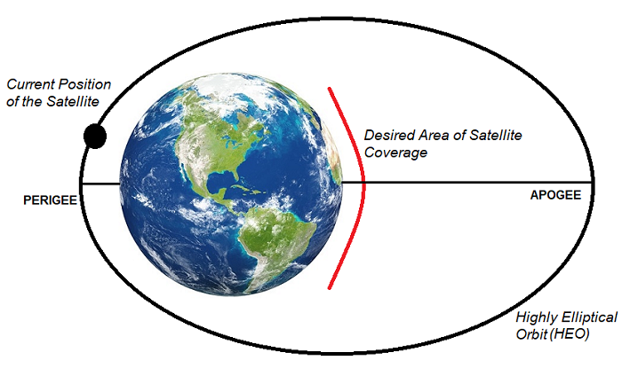
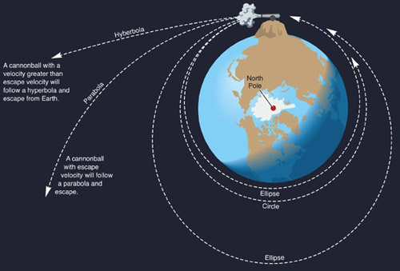

# Trajectories of a Freely Released Payload Near Earth

## Introduction

When an object is released from a moving rocket near Earth, its trajectory depends on initial conditions (position, velocity, altitude) and gravitational forces. This problem integrates orbital mechanics and numerical methods, offering insights critical for space missions like payload deployment or reentry.

This document analyzes possible trajectories (parabolic, hyperbolic, elliptical) of a payload released near Earth, performs a numerical simulation of its path, and develops a Python tool to visualize the motion under Earth's gravity. It leverages Newton's Law of Gravitation and Kepler's Laws for derivations.

---

## Definitions and Physical Meaning

### Trajectory Types

- **Elliptical**: Closed orbit; payload remains bound to Earth (e.g., satellite orbits).

- **Parabolic**: Boundary case; payload escapes with zero residual velocity at infinity.
- **Hyperbolic**: Open trajectory; payload escapes with excess velocity.

- **Physical Meaning**: The trajectory depends on the payload’s specific energy, determined by initial velocity and position relative to Earth’s gravitational potential.

---

## Mathematical Derivations

### Newton’s Law of Gravitation

Gravitational force between Earth and payload:
$$
F = \frac{G M m}{r^2}
$$
Where:

- $G = 6.67430 \times 10^{-11} \, \text{m}^3 \text{kg}^{-1} \text{s}^{-2}$ (gravitational constant),
- $M = 5.972 \times 10^{24} \, \text{kg}$ (Earth’s mass),
- $m$ = payload mass,
- $r$ = distance from Earth’s center.

Acceleration:
$$
\ddot{\mathbf{r}} = -\frac{G M}{r^3} \mathbf{r}
$$

### Specific Energy and Trajectory Type

Total specific energy ($\epsilon$) determines the trajectory:

$$
\epsilon = \frac{v^2}{2} - \frac{G M}{r}
$$

- $\epsilon < 0$: Elliptical (bound orbit),
- $\epsilon = 0$: Parabolic (escape velocity),
- $\epsilon > 0$: Hyperbolic (excess velocity).

### Escape Velocity

Minimum speed to escape Earth:
$$
v_{\text{esc}} = \sqrt{\frac{2 G M}{r}}
$$

### Orbital Elements (Simplified)

Semi-major axis ($a$) for elliptical orbits:
$$
a = -\frac{G M}{2 \epsilon} \quad (\epsilon < 0)
$$

---

## Parameters Affecting Trajectories

- **Initial Velocity ($v_0$)**: Magnitude and direction relative to Earth.
- **Initial Position ($r_0$)**: Altitude above Earth’s surface.
- **Earth’s Mass ($M$)**: Fixed gravitational influence.
- **Altitude**: Affects gravitational strength ($r = R_{\text{Earth}} + h$).

---

## Calculations and Simulation

### Initial Conditions

- Earth radius: $R_{\text{Earth}} = 6,371 \, \text{km}$,
- Altitude: $h = 400 \, \text{km}$ (e.g., LEO),
- Initial position: $r_0 = 6,771 \, \text{km}$,
- Velocities: $v_0 = 7.5 \, \text{km/s}$ (elliptical), $11.2 \, \text{km/s}$ (parabolic), $12.0 \, \text{km/s}$ (hyperbolic),
- Direction: Tangential to Earth’s surface.

### Python Script

# Results and Importance of Payload Trajectories Near Earth

## Results of Trajectory Simulations

### Calculated Trajectories

- **Elliptical ($v_0 = 7.5 \, \text{km/s}$)**:
  - Bound orbit, payload circles Earth.
  - Specific energy: $\epsilon < 0$.
- **Parabolic ($v_0 = 11.2 \, \text{km/s}$)**:
  - Escape trajectory, zero velocity at infinity.
  - Specific energy: $\epsilon = 0$.
- **Hyperbolic ($v_0 = 12.0 \, \text{km/s}$)**:
  - Excess velocity escape, open path.
  - Specific energy: $\epsilon > 0$.

The Python script generates a plot showing:

- Elliptical: Closed loop around Earth.
- Parabolic: Boundary escape path.
- Hyperbolic: Diverging trajectory.

Initial conditions: Released at $400 \, \text{km}$ altitude ($r_0 = 6,771 \, \text{km}$), tangential velocity.

---

## Importance in Space Exploration

### Orbital Insertion

- **Elliptical Trajectories**: Payloads with $v_0 < v_{\text{esc}}$ (e.g., $7.5 \, \text{km/s}$ at $400 \, \text{km}$) enter stable orbits, critical for satellite deployment.
  $$
  v_{\text{esc}} = \sqrt{\frac{2 G M}{r_0}} \approx 11.2 \, \text{km/s}
  $$

### Reentry Scenarios

- **Sub-Elliptical Velocities**: If $v_0$ is insufficient for orbit, the payload follows a ballistic path, intersecting Earth (reentry).

### Escape Scenarios

- **Parabolic and Hyperbolic Trajectories**: Velocities at or above $v_{\text{esc}}$ (e.g., $11.2 \, \text{km/s}$ or $12.0 \, \text{km/s}$) enable escape, relevant for interplanetary missions.
  - Parabolic: Minimal energy escape.
  - Hyperbolic: Excess energy for faster departure.

  --------------------------------------------------------------

  ## 🌟 Interesting Fact: Light Sail Probes Could Reach 10% of Light Speed!  

Scientists are working on a **revolutionary space probe** that could travel at **10% the speed of light (0.1c)** using **solar sail technology**. 🚀  

### 🔬 How Does It Work?  

- The probe will use an **ultra-thin, reflective sail** to catch energy from **powerful lasers or sunlight**.  
- **Radiation pressure** (from photons bouncing off the sail) will provide continuous thrust.  
- Over time, this can accelerate the spacecraft to **~30,000 km/s**!  

### 🌌 Why Is This Important?  

- At **0.1c**, a probe could reach **Alpha Centauri**, the nearest star system, in **40-50 years** instead of thousands!  
- This could allow us to explore **interstellar space** within a human lifetime.  

### 🚀 Challenges to Overcome  

- Developing **powerful laser systems** to propel the sail.  
- Ensuring the **sail withstands extreme forces**.  
- Communicating across **vast interstellar distances**.  

### 🔥 Future Possibilities  

If successful, this technology could lead to **fast interstellar probes** and even **human space travel beyond our solar system**!  

👉 This concept is being actively researched by the **Breakthrough Starshot** initiative.  
