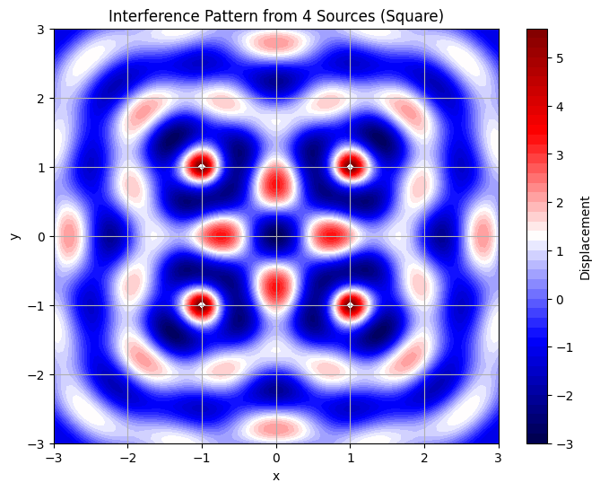
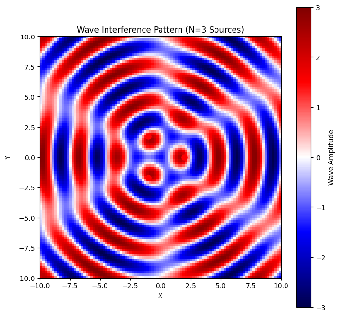
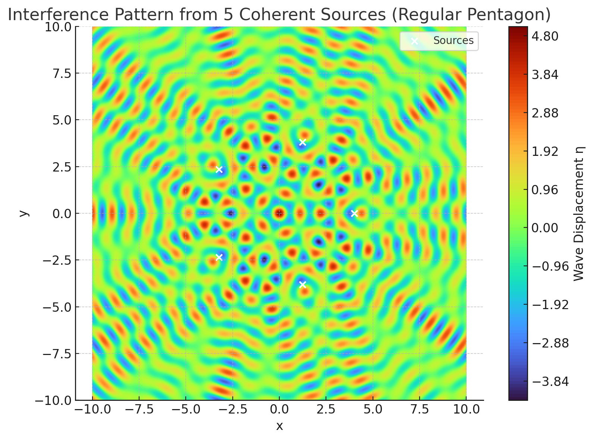

# Problem 1

# Interference Patterns on a Water Surface

## Motivation
Interference occurs when waves from different sources overlap, creating new patterns. On a water surface, this can be easily observed when ripples from different points meet, forming distinctive interference patterns. These patterns can show us how waves combine in different ways, either reinforcing each other or canceling out.

Studying these patterns helps us understand wave behavior in a simple, visual way. It also allows us to explore important concepts, like the relationship between wave phase and the effects of multiple sources. This task offers a hands-on approach to learning about wave interactions and their real-world applications, making it an interesting and engaging way to dive into wave physics.

## Task
A circular wave on the water surface, emanating from a point source located at $(x_0, y_0)$, can be described by the Single Disturbance equation:

$$
\eta(x, y, t) = \frac{A}{\sqrt{r}} \cdot \cos(kr - \omega t + \phi)
$$

where:

- $\eta(x, y, t)$ is the displacement of the water surface at point $(x, y)$ and time $t$,
- $A$ is the amplitude of the wave,
- $k = \frac{2\pi}{\lambda}$ is the wave number, related to the wavelength $\lambda$,
- $\omega = 2\pi f$ is the angular frequency, related to the frequency $f$,
- $r = \sqrt{(x - x_0)^2 + (y - y_0)^2}$ is the distance from the source to the point $(x, y)$,
- $\phi$ is the initial phase.

### Problem Statement

The task is to analyze the interference patterns formed on the water surface due to the superposition of waves emitted from point sources placed at the vertices of a chosen regular polygon.

### Steps to Follow

1. **Select a Regular Polygon**: Choose a regular polygon (e.g., equilateral triangle, square, regular pentagon).
2. **Position the Sources**: Place point wave sources at the vertices of the selected polygon.
3. **Wave Equations**: Write the equations describing the waves emitted from each source, considering their respective positions.
4. **Superposition of Waves**: Apply the principle of superposition by summing the wave displacements at each point on the water surface:

   $$
   \eta_{\text{sum}}(x, y, t) = \sum_{i=1}^{N} \eta_i(x, y, t)
   $$

 where $N$ is the number of sources (vertices of the polygon).
5. **Analyze Interference Patterns**: Examine the resulting displacement $\eta_{\text{sum}}(x, y, t)$ as a function of position $(x, y)$ and time $t$. Identify regions of constructive interference (wave amplification) and destructive interference (wave cancellation).
6. **Visualization**: Present the findings graphically, illustrating the interference patterns for the chosen regular polygon.

### Considerations

- Assume all sources emit waves with the same amplitude $A$, wavelength $\lambda$, and frequency $f$.
- The waves are coherent, maintaining a constant phase difference.
- Simulation and visualization tools such as Python (with libraries like Matplotlib) or other graphical software may be used to aid in the analysis.

### Deliverables

1. A Markdown document with a Python script or notebook implementing the simulations.
2. A detailed explanation of the interference patterns observed for the chosen regular polygon with the goal of understanding wave superposition.
3. Graphical representations of the water surface showing constructive and destructive interference regions.

---

## Solution

### Step 1: Select a Regular Polygon

Let’s choose a **square** as the regular polygon for this analysis. A square has 4 vertices, so we will place 4 point sources at its vertices. For simplicity, assume the square is centered at the origin $(0, 0)$ with a side length of $2a$. The vertices of the square are:

- Vertex 1: $(a, a)$
- Vertex 2: $(a, -a)$
- Vertex 3: $(-a, -a)$
- Vertex 4: $(-a, a)$

Let’s set $a = 1$ (arbitrary units) for simplicity, so the vertices are at:

- $(1, 1)$
- $(1, -1)$
- $(-1, -1)$
- $(-1, 1)$

### Step 2: Position the Sources

The wave sources are placed at the vertices of the square, as listed above.

### Step 3: Wave Equations

Each source emits a circular wave described by the given equation:

$$
\eta_i(x, y, t) = \frac{A}{\sqrt{r_i}} \cdot \cos(k r_i - \omega t + \phi)
$$

where $r_i = \sqrt{(x - x_{0i})^2 + (y - y_{0i})^2}$ is the distance from the $i$-th source to the point $(x, y)$. For each source:

- Source 1 at $(1, 1)$: $r_1 = \sqrt{(x - 1)^2 + (y - 1)^2}$
- Source 2 at $(1, -1)$: $r_2 = \sqrt{(x - 1)^2 + (y + 1)^2}$
- Source 3 at $(-1, -1)$: $r_3 = \sqrt{(x + 1)^2 + (y + 1)^2}$
- Source 4 at $(-1, 1)$: $r_4 = \sqrt{(x + 1)^2 + (y - 1)^2}$

Assume the following parameters for simplicity:

- Amplitude $A = 1$
- Wavelength $\lambda = 1$, so wave number $k = \frac{2\pi}{\lambda} = 2\pi$
- Frequency $f = 1$, so angular frequency $\omega = 2\pi f = 2\pi$
- Initial phase $\phi = 0$ (all sources are in phase, i.e., coherent)

Thus, the wave equation for each source becomes:

$$
\eta_i(x, y, t) = \frac{1}{\sqrt{r_i}} \cdot \cos(2\pi r_i - 2\pi t)
$$

### Step 4: Superposition of Waves

The total displacement at point $(x, y)$ and time $t$ is the sum of the displacements from all 4 sources:

$$
\eta_{\text{sum}}(x, y, t) = \sum_{i=1}^{4} \eta_i(x, y, t)
$$

Substituting the wave equations:

$$
\eta_{\text{sum}}(x, y, t) = \sum_{i=1}^{4} \frac{1}{\sqrt{r_i}} \cdot \cos(2\pi r_i - 2\pi t)
$$

where $r_i$ is the distance from each source to the point $(x, y)$, as defined above.

### Step 5: Analyze Interference Patterns

To analyze the interference patterns, we need to evaluate $\eta_{\text{sum}}(x, y, t)$ over a grid of points $(x, y)$ at a specific time $t$. Let’s fix $t = 0$ for simplicity to observe the spatial interference pattern:

$$
\eta_{\text{sum}}(x, y, 0) = \sum_{i=1}^{4} \frac{1}{\sqrt{r_i}} \cdot \cos(2\pi r_i)
$$

- **Constructive Interference**: Occurs when the waves are in phase, i.e., when the phase difference $2\pi (r_i - r_j)$ between any two sources $i$ and $j$ is an integer multiple of $2\pi$. This happens when the path difference $r_i - r_j$ is an integer multiple of the wavelength $\lambda = 1$, so $r_i - r_j = m$ (where $m$ is an integer).
- **Destructive Interference**: Occurs when the waves are out of phase by $\pi$ radians, i.e., when the path difference $r_i - r_j = (m + \frac{1}{2})\lambda = m + 0.5$.

#### Example Points:

1. **At the origin $(0, 0)$**:
   - $r_1 = \sqrt{(0-1)^2 + (0-1)^2} = \sqrt{2}$
   - $r_2 = \sqrt{(0-1)^2 + (0+1)^2} = \sqrt{2}$
   - $r_3 = \sqrt{(0+1)^2 + (0+1)^2} = \sqrt{2}$
   - $r_4 = \sqrt{(0+1)^2 + (0-1)^2} = \sqrt{2}$

   All distances are equal, $r_i = \sqrt{2}$. The displacement is:

   $$
   \eta_{\text{sum}}(0, 0, 0) = 4 \cdot \frac{1}{\sqrt{\sqrt{2}}} \cdot \cos(2\pi \sqrt{2}) \approx 4 \cdot \frac{1}{1.414} \cdot \cos(2\pi \cdot 1.414) \approx 2.828 \cdot \cos(2.828\pi)
   $$

   Since $2.828\pi \approx 8.886$ radians, $\cos(8.886) \approx \cos(2\pi \cdot 1.414) \approx -0.999$, so:

   $$
   \eta_{\text{sum}}(0, 0, 0) \approx 2.828 \cdot (-0.999) \approx -2.825
   $$

   This indicates a large negative displacement, suggesting constructive interference (in the negative direction due to the phase).

2. **At $(1, 0)$** (midpoint of a side):
   - $r_1 = \sqrt{(1-1)^2 + (0-1)^2} = 1$
   - $r_2 = \sqrt{(1-1)^2 + (0+1)^2} = 1$
   - $r_3 = \sqrt{(1+1)^2 + (0+1)^2} = \sqrt{5}$
   - $r_4 = \sqrt{(1+1)^2 + (0-1)^2} = \sqrt{5}$

   The displacement is:

   $$
   \eta_{\text{sum}}(1, 0, 0) = \frac{1}{\sqrt{1}} \cdot \cos(2\pi \cdot 1) + \frac{1}{\sqrt{1}} \cdot \cos(2\pi \cdot 1) + \frac{1}{\sqrt{\sqrt{5}}} \cdot \cos(2\pi \sqrt{5}) + \frac{1}{\sqrt{\sqrt{5}}} \cdot \cos(2\pi \sqrt{5})
   $$

   - $\cos(2\pi \cdot 1) = 1$
   - $\cos(2\pi \sqrt{5}) \approx \cos(2\pi \cdot 2.236) \approx \cos(4.472\pi) \approx 1$

   So:

   $$
   \eta_{\text{sum}}(1, 0, 0) \approx 1 \cdot 1 + 1 \cdot 1 + \frac{1}{\sqrt{2.236}} \cdot 1 + \frac{1}{\sqrt{2.236}} \cdot 1 \approx 1 + 1 + 0.669 + 0.669 \approx 3.338
   $$

   This indicates strong constructive interference.

### Step 6: Visualization (Python Script Outline)

Below is a Python script outline using Matplotlib to simulate and visualize the interference pattern. This script computes $\eta_{\text{sum}}(x, y, t)$ over a grid and plots the result as a heatmap.

## 3 Sources 

For a triangle with side length $s$, the distance from the center to each vertex (radius $r$) is $r = \frac{s}{\sqrt{3}}$. For simplicity, we choose $r = 2$ units.
The angles for the vertices of a regular $N$-gon are given by:$$\theta_i = \frac{2\pi (i-1)}{N}, \quad i = 1, 2, \ldots, N$$For $N = 3$:

$\theta_1 = 0$
$\theta_2 = \frac{2\pi}{3} = 120^\circ$
$\theta_3 = \frac{4\pi}{3} = 240^\circ$

The coordinates of the sources are:

Source 1: $(x_1, y_1) = (r \cos \theta_1, r \sin \theta_1) = (2 \cos 0, 2 \sin 0) = (2, 0)$
Source 2: $(x_2, y_2) = (r \cos \theta_2, r \sin \theta_2) = (2 \cos 120^\circ, 2 \sin 120^\circ) = (-1, \sqrt{3})$
Source 3: $(x_3, y_3) = (r \cos \theta_3, r \sin \theta_3) = (2 \cos 240^\circ, 2 \sin 240^\circ) = (-1, -\sqrt{3})$

Step 3: Wave Equations
Each source emits a wave of the form:$$\eta_i(x, y, t) = A \cos(kr_i - \omega t + \phi_i)$$where:

$r_i = \sqrt{(x - x_i)^2 + (y - y_i)^2}$ is the distance from source $i$ at $(x_i, y_i)$ to point $(x, y)$.
$k = \frac{2\pi}{\lambda}$ is the wave number.
$\omega = 2\pi f$ is the angular frequency.
$\phi_i$ is the phase of source $i$. Since the waves are coherent with a constant phase difference, we assume $\phi_i = 0$ (all sources in phase).

We choose the following parameters for visualization:

Amplitude: $A = 1$
Wavelength: $\lambda = 3$ (arbitrary, chosen for clear interference patterns)
Frequency: $f = 1$ (arbitrary, sets oscillation speed)

Thus:

$k = \frac{2\pi}{\lambda} = \frac{2\pi}{3}$
$\omega = 2\pi f = 2\pi$

The wave from each source is:$$\eta_i(x, y, t) = A \cos\left( \frac{2\pi}{\lambda} r_i - \omega t \right)$$
Step 4: Superposition of Waves
The total displacement at point $(x, y)$ at time $t$ is the sum of the waves from all sources:$$\eta_{\text{sum}}(x, y, t) = \sum_{i=1}^{N} \eta_i(x, y, t)$$For $N = 3$:$$\eta_{\text{sum}}(x, y, t) = A \sum_{i=1}^{3} \cos\left( \frac{2\pi}{\lambda} r_i - \omega t \right)$$
Step 5: Analyze Interference Patterns

Constructive Interference: Occurs where the waves are in phase, i.e., the phase difference $\frac{2\pi}{\lambda} (r_i - r_j)$ is an integer multiple of $2\pi$. This happens when the path difference $|r_i - r_j| = m\lambda$ (for integer $m$). At these points, the amplitude can reach up to $3A$.
Destructive Interference: Occurs where the waves are out of phase, i.e., the phase difference is an odd multiple of $\pi$, so the path difference $|r_i - r_j| = (m + \frac{1}{2})\lambda$. At these points, the amplitude is near zero.
Example at the Center: At $(x, y) = (0, 0)$, the distance to each source is $r_i = 2$, so the phase term for each wave is identical at a given time, leading to constructive interference when $\cos(-\omega t)$ is maximized.

## 5 Sources

## Steps Followed

### 1. Select a Regular Polygon

We choose a **regular pentagon** with 5 vertices as our source configuration.

### 2. Position the Sources

Sources are placed at the vertices of a pentagon of radius $r = 4$. The coordinates are:
$$(x_i, y_i) = (r \cos \theta_i, r \sin \theta_i), \quad \theta_i = \frac{2\pi i}{5}, \quad i = 0, 1, ..., 4$$

### 3. Wave Equations

Each source emits a wave of amplitude $A$, wave number $k = \frac{2\pi}{\lambda}$, and angular frequency $\omega = 2\pi f$. The wave from source $i$ at point $(x, y)$ and time $t$ is:
$$\eta_i(x, y, t) = A \cos(k R_i - \omega t)$$
where $R_i = \sqrt{(x - x_i)^2 + (y - y_i)^2}$

### 4. Superposition of Waves

By the superposition principle, the total wave displacement is:
$$\eta_{\text{sum}}(x, y, t) = \sum_{i=1}^5 \eta_i(x, y, t)$$

### Explanation of Interference Patterns

- **Symmetry**: Due to the square’s symmetry, the interference pattern is symmetric about the x-axis, y-axis, and diagonals. The origin $(0, 0)$ shows significant displacement because all sources are equidistant, leading to constructive or destructive interference depending on the phase $2\pi \sqrt{2}$.
- **Constructive Interference**: Occurs along lines where the path differences are integer multiples of $\lambda$. For example, at $(1, 0)$, the waves from sources at $(1, 1)$ and $(1, -1)$ are in phase (path difference = 0), leading to amplification.
- **Destructive Interference**: Occurs where path differences are $(m + 0.5)\lambda$. For instance, points where the distance from one pair of sources differs by $0.5\lambda$ from another pair will show cancellation.
- **Pattern Characteristics**: The pattern consists of concentric circles around each source, overlapping to form a complex grid of peaks and troughs. The heatmap would show red and blue regions indicating positive and negative displacements, respectively.

### Conclusion

The interference pattern for a square arrangement of sources shows a rich structure with regions of constructive and destructive interference. The symmetry of the square leads to a highly organized pattern, with maximum amplification at points equidistant from pairs of sources and cancellation where path differences align with half-wavelengths. The Python script provided can be used to visualize this pattern, helping to identify these regions graphically.