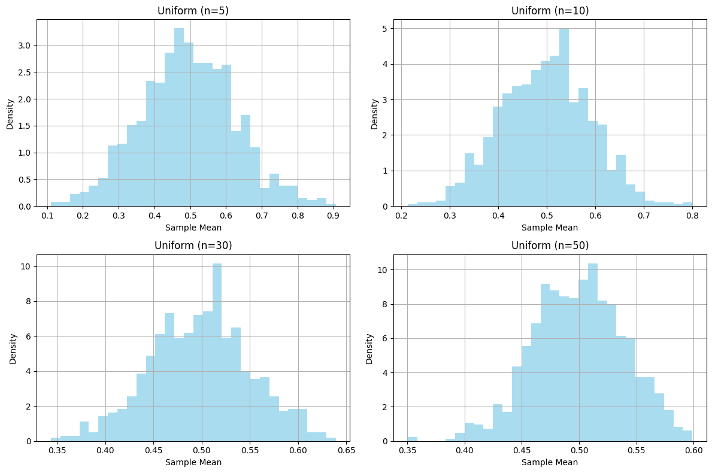
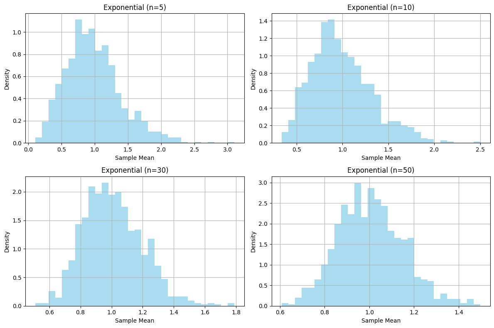
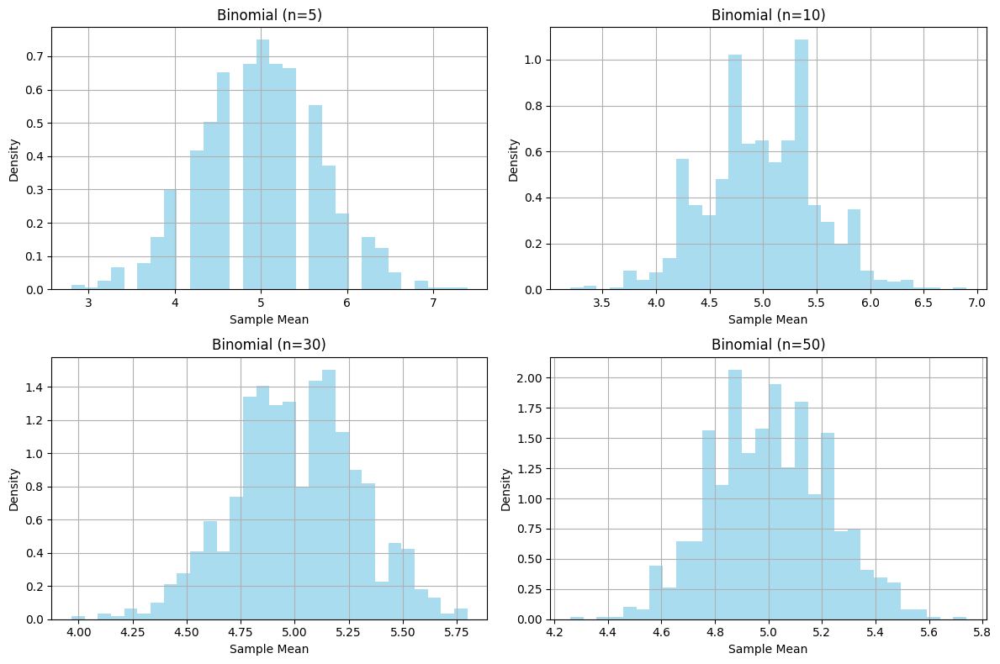

# Problem 1

## Exploring the Central Limit Theorem through Simulations

### Motivation

The Central Limit Theorem (CLT) states that the sampling distribution of the sample mean approaches a normal distribution as the sample size $n$ increases, regardless of the population's original distribution. This simulation-based exploration demonstrates the CLT in action by generating sampling distributions from different population distributions and visualizing their convergence to normality.

## Task 1: Simulating Sampling Distributions

### Step 1: Generate Population Datasets

We simulate three population distributions with 100,000 data points each:

- Uniform Distribution: Values between 0 and 1, using np.random.uniform(0, 1, 100000).

- Exponential Distribution: Values with a rate parameter $\lambda = 1$, using np.random.exponential(1, 100000).

- Binomial Distribution: Values with $n=10$ trials and probability $p=0.5$, using np.random.binomial(10, 0.5, 100000).

### Step 2: Sampling and Visualization

For each population distribution:

- Draw random samples of sizes $n = 5, 10, 30, 50$.
For each sample size, take 1,000 samples, compute the sample mean for each, and store the means.

- Plot histograms of the sample means to observe their distribution.

Below is the Python code to perform these simulations and visualizations using NumPy and Matplotlib:

## Task 2: Parameter Exploration

### Convergence to Normality

The histograms show that as the sample size $n$ increases, the distribution of sample means becomes more bell-shaped, resembling a normal distribution. For the uniform distribution (mean $\mu = 0.5$, variance $\sigma^2 = \frac{1}{12}$), the sample means for $n=5$ are somewhat flat but become more normal by $n=50$. The exponential distribution (mean $\mu = 1$, variance $\sigma^2 = 1$) starts skewed but approaches normality faster. The binomial distribution (mean $\mu = np = 5$, variance $\sigma^2 = np(1-p) = 2.5$) shows a similar trend.

### Impact of Population Variance

The CLT predicts that the variance of the sampling distribution of the mean is $\frac{\sigma^2}{n}$, where $\sigma^2$ is the population variance. The binomial distribution has a higher variance (2.5) compared to the uniform distribution (0.083), leading to a wider spread of sample means for smaller $n$. As $n$ increases, the spread decreases proportionally, aligning with the CLT.

## Task 3: Practical Applications

The CLT is crucial in real-world scenarios:

Estimating Population Parameters: It justifies using the sample mean to estimate the population mean, even for non-normal populations, as long as the sample size is large.
Quality Control in Manufacturing: It helps model the distribution of product measurements, ensuring consistency.
Predicting Outcomes in Financial Models: It underpins risk assessment by assuming normality for aggregated returns.

## Conclusion

This simulation confirms the CLT: regardless of the population distribution, the sampling distribution of the sample mean approaches a normal distribution as the sample size increases. The rate of convergence depends on the population's shape and variance, with larger sample sizes and less skewed distributions converging faster. These insights are foundational for statistical inference and practical applications in diverse fields.
