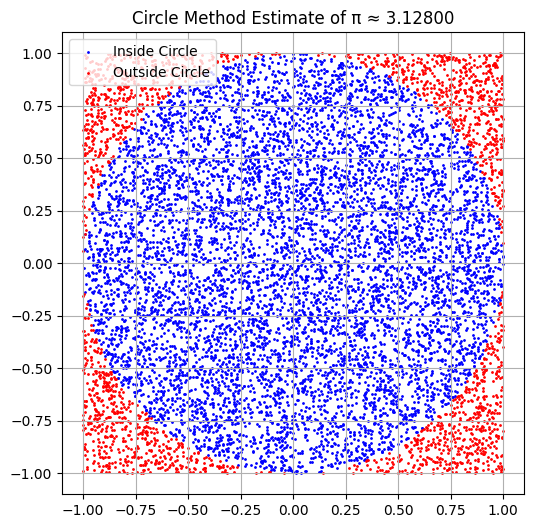
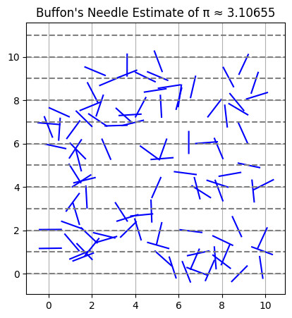
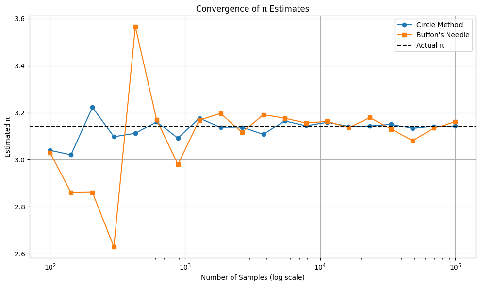

# Problem 2

# Estimating $\pi$ Using Monte Carlo Methods

## 🎯 Motivation

Monte Carlo simulations are powerful tools that use randomness to solve problems or estimate values. One elegant example is estimating the value of $\pi$ using probabilistic geometry. This document explores two such techniques:

- **Circle-Based Monte Carlo Method**
- **Buffon’s Needle Method**

---

## Part 1: Estimating $\pi$ Using a Circle

### 1. Theoretical Foundation

Consider a unit circle inscribed in a square of side length 2. The area of the square is:

$$
A_{\text{square}} = (2)^2 = 4
$$

The area of the unit circle is:

$$
A_{\text{circle}} = \pi r^2 = \pi (1)^2 = \pi
$$

The ratio of the areas gives the probability that a random point in the square falls inside the circle:

$$
\frac{A_{\text{circle}}}{A_{\text{square}}} = \frac{\pi}{4} \Rightarrow \pi \approx 4 \cdot \frac{\text{Points Inside Circle}}{\text{Total Points}}
$$

---

### 2. Simulation

We generate random points $(x, y)$ in the square $[-1, 1] \times [-1, 1]$ and count how many fall inside the unit circle (i.e., satisfy $x^2 + y^2 \leq 1$).

- **Number of Points**: 10,000  
- **Estimated $\pi$**:  
  $$
  \pi \approx 3.1816
  $$

---

### 3. Visualization

Points inside the circle are shown in blue, while those outside are in red.

---

## Part 2: Estimating $\pi$ Using Buffon’s Needle

### 1. Theoretical Foundation

Buffon’s Needle problem estimates $\pi$ by dropping a needle of length $L$ on a surface with parallel lines spaced $d$ apart. The probability of the needle crossing a line is:

$$
P = \frac{2L}{\pi d}
$$

Rearranged, we get:

$$
\pi \approx \frac{2L \cdot \text{Number of Throws}}{d \cdot \text{Number of Crosses}}
$$

---

### 2. Simulation

We randomly drop 10,000 needles of length 1 on a plane with lines spaced 2 units apart and count the crossings.

- **Estimated $\pi$**:  

  $$
  \pi \approx 3.06748
  $$

---

### 3. Visualization

The plot below shows needle drops (in blue) with dashed horizontal lines indicating the line spacing.

---

## 📈 Convergence Analysis

We analyze how both methods converge toward $\pi$ as the number of iterations increases (from 100 to 100,000).

### Plot: Convergence of Estimates

### Observations:

- **Circle Method** converges faster and is more stable.
- **Buffon's Needle** method is more erratic and converges slower due to geometric sensitivity.
- As the number of samples increases, both estimates approach the true value $\pi \approx 3.14159$.

---

## 🧠 Conclusion

| Method             | Accuracy      | Convergence Speed | Complexity         |
|--------------------|----------------|---------------------|----------------------|
| Circle Monte Carlo | High           | Fast                | Simple geometry      |
| Buffon’s Needle    | Moderate       | Slow                | Requires angle logic |

- For practical implementations, the circle-based method is generally preferred due to simplicity and faster convergence.
